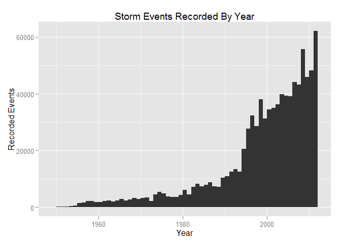
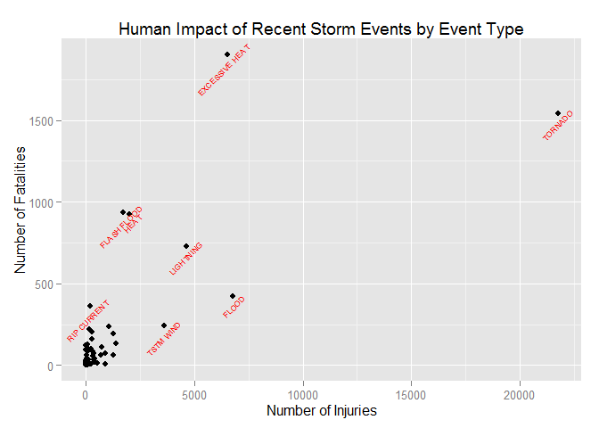

# NOAA Storm Data Analysis
Carey Free  

##Synopsis
The National Oceanic and Atmospheric Administration (NOAA) provides data on the occurrence and consequences of various types of storm event. By analyzing data from recent years, the storm event types resulting in the most human and economic damages can be assessed.

##Data Processing
The storm data was acquired in a compressed csv file that can be read directly.

```r
rawData <- read.csv(file = "repdata-data-StormData.csv.bz2",
                    stringsAsFactors = FALSE)
```

Many variables tracked in the data set are not relevent for the high level analysis we are performing and can be discarded. Only the occurance data, event type, and damage information needs to be retained.

```r
prunedData <- rawData[,c("BGN_DATE",
                         "EVTYPE",
                         "FATALITIES", "INJURIES",
                         "PROPDMG", "PROPDMGEXP",
                         "CROPDMG", "CROPDMGEXP")]
```

The specification for the data set allow for three different magnitudes for damage estimates: K (thousands of dollars), M (millions), and B (billions). Allowing for lower case usage and absent values (indicating nonexponentiated damage estimates), a number a records remain with invalid damage estimate exponents that must be removed.

```r
validExponents <- c("", "K", "k", "M", "m", "B", "b")
prunedData <- prunedData[(prunedData$PROPDMGEXP %in% validExponents)
                         & (prunedData$CROPDMGEXP %in% validExponents),]
```

Having restricted the exponents to valid values, we can apply them to the damage estimates.

```r
applyExponent <- function (value, exp) {
    if (is.na(value) | is.na(exp) | exp == "")
    {
        value
    }
    else
    {
        multiplier <- switch(exp,
                             K = 1000, k = 1000,
                             M = 1000000, m = 1000000,
                             B = 1000000000, b = 1000000000)
        value * multiplier
    }
}
prunedData$PropertyDamage <- mapply(applyExponent,
                                    prunedData$PROPDMG,
                                    prunedData$PROPDMGEXP)
prunedData$CropDamage <- mapply(applyExponent,
                                prunedData$CROPDMG,
                                prunedData$CROPDMGEXP)
```

Two variables read in as strings need to be converted to more useful data types. BGN_DATE will be converted to a POSIXct date-time and EVTYPE will be converted to a factor.

```r
library(lubridate)
prunedData$Date <- mdy_hms(prunedData$BGN_DATE)
prunedData$EventType <- factor(prunedData$EVTYPE)
```

With calculation and type conversions complete, the original columns involved can be discarded. Additionally, the population damage variable can be given friendlier names.

```r
prunedData <- prunedData[,c("Date", "EventType",
                            "INJURIES", "FATALITIES",
                            "PropertyDamage", "CropDamage")]
colnames(prunedData)[c(3,4)] <- c("Injuries", "Fatalities")
```

##Results
Since the data set spans such a long period, we may wish to constrain our analysis to more recent years with more complete data records. To make this decision, we can look at the time distribution of the available records. A simple histogram of the year for each record will be sufficient.

```r
library(ggplot2)
ggplot(data = prunedData,
       aes(x = year(Date))) +
    geom_histogram(binwidth = 1) +
    labs(title = "Storm Events Recorded By Year",
         x = "Year",
         y = "Recorded Events")
```

 

Since there is a major uptick in recorded events leading into the new millenium, we will focus our analysis on the last twenty years.

```r
library(reshape2)
twentyAgo <- ymd("1995-01-01")
recentData <- melt(data = prunedData[prunedData$Date >= twentyAgo,],
                   id.vars = c("Date", "EventType"))
recentData <- dcast(data = recentData,
                    formula = EventType ~ variable,
                    fun.aggregate = sum)
```

It is difficult to make some sort of comparison between injuries and fatalities to combine them into some single measure of harm to the population's health. By plotting each on its own axis, we can get a feel for the overall harm done by particular storm event types in the past twenty years.

```r
ggplot(data = recentData,
       aes(x = Injuries,
           y = Fatalities,
           label = EventType)) +
    geom_point() +
    geom_text(data = subset(x = recentData,
                            subset = Fatalities > 350 | Injuries > 2500),
              color = "red",
              size = 2.5,
              vjust = 1.5,
              hjust = 0.7,
              angle = 45) +
    labs(title = "Human Impact of Recent Storm Events by Event Type",
         x = "Number of Injuries",
         y = "Number of Fatalities")
```

 

Tornado and Excessive Heat events stand as clear outliers in terms of both injuries and fatalities. Flash Flood, Heat, Lightning, Flood, Rip Current, and TSTM Wind events also cause more human damage than other event types.

Economic damages can be combined by dollar value and used to compare event types directly.

```r
ggplot(data = recentData,
       aes(x = (CropDamage + PropertyDamage) / 1.0e+9,
           y = 0,
           ymin = -1,
           ymax = 1,
           xmin = 0)) +
    geom_dotplot(data = subset(x = recentData,
                               subset = CropDamage + PropertyDamage <= 1.0e+10),
                 binwidth = 2,
                 stackdir = "center") +
    geom_dotplot(data = subset(x = recentData,
                               subset = CropDamage + PropertyDamage > 1.0e+10),
                 binwidth = 2,
                 binpositions = "all",
                 stackgroups = TRUE,
                 stackdir = "center",
                 aes(color = EventType,
                     fill = EventType)) +
    labs(title = "Economic Impact of Recent Storm Events by Event Type",
         x = "Damage (Billions of Dollars)") +
    scale_y_continuous(name = "",
                       breaks = NULL)
```

 

Floods are the most damaging events by a large margin. Hurricane/Typhoon events and Storm Surge events also cause very large amounts of damage. Droughts, Flash Floods, Hail, Hurricanes, and Tornadoes cause more damage than most other storm event types.
